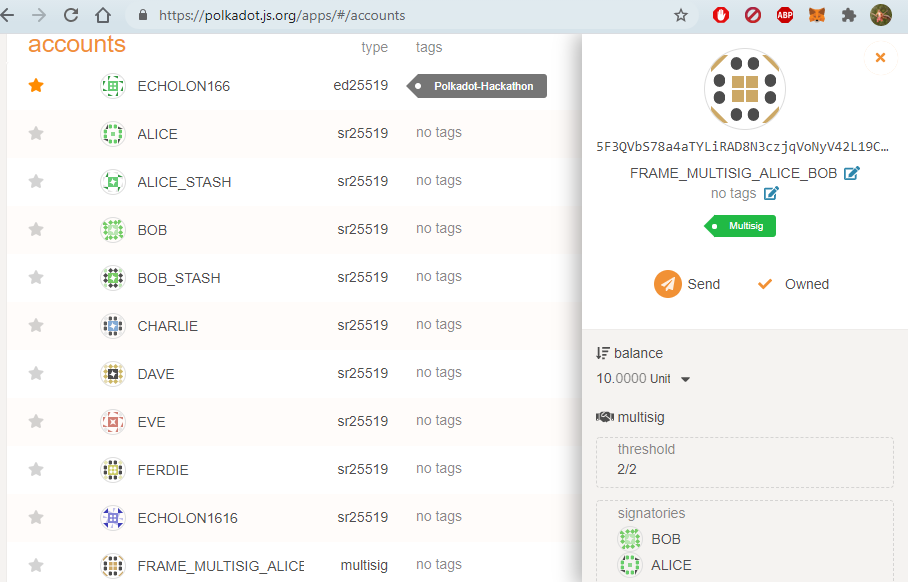
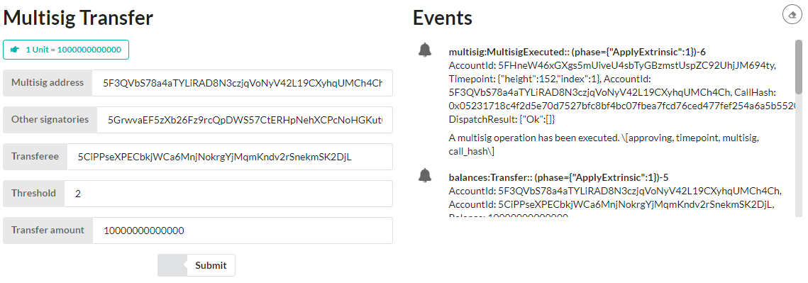
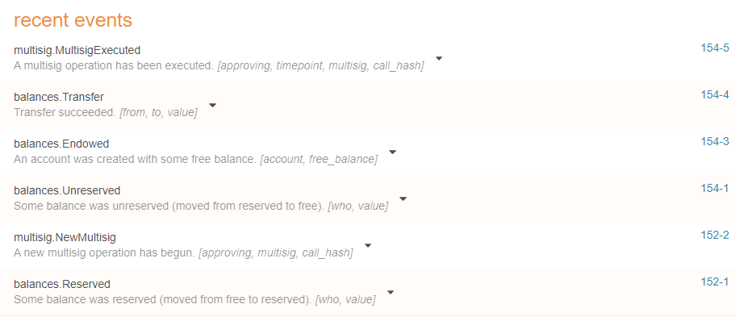
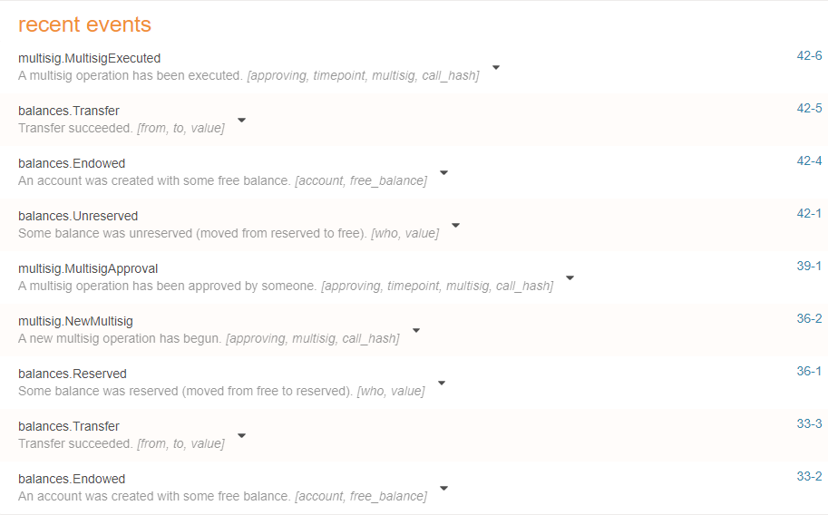

# Frame Multisig

Node: https://github.com/Echolon166/HelloWorldbyPolkadot/blob/main/frame_multisig/node

Front-end: https://github.com/Echolon166/HelloWorldbyPolkadot/blob/main/frame_multisig/front-end

Polkadot-JS Script: https://github.com/Echolon166/HelloWorldbyPolkadot/blob/main/frame_multisig/script

- Multisig address in polkadot.js.org/apps:



- Multisig transfer in front-end:



- Event history after making the transfer in front-end:



- Running the script: 

```
$ cd script
$ npm install
$ node index.js

? Transferor:  alice
? Signatories:  bob, charlie   
? Transferee:  dave
? Threshold:  3     
? Transfer amount:  1000

- Transferee dave address balance before transaction: 0

- Encoding multisig address using transferor & other signatory addresses.
Multisig Address: 5EAkPWNziBqEnrw6hkjFVu6EJej7Xf9wEK4CXir6YDS4kvUL       

- Initialising the multisig address by sending the funds from transferor.
Multisig address balance before transfer: 0
Transaction Status: Ready
Transaction Status: InBlock
Transaction Status: Finalized
Multisig address balance after transfer: 1000000000000000

- Get multisig transfer tx.
Tx Hash: 0x9d9691b1eb211f385bcde81cabb853c47b41c3ce9f614a1fb828876223470a82
Tx Data: 0x0600306721211d5404bd9da88e0204360a1a9ab8b87c66c1bc2fcdd37f3c2222cc200f0080c6a47e8d03

- Transferor(Main Signatory) alice approves the transaction.
Transaction Status: Ready
Transaction Status: InBlock
Transaction Status: Finalized

- Signatory bob approves the transaction.
Transaction Status: Ready
Transaction Status: InBlock
Transaction Status: Finalized

- Signatory charlie approves the transaction.
Transaction Status: Ready
Transaction Status: InBlock
Transaction Status: Finalized

- Transferee dave address balance after transaction: 1000000000000000
```

- Event history after running the script:

