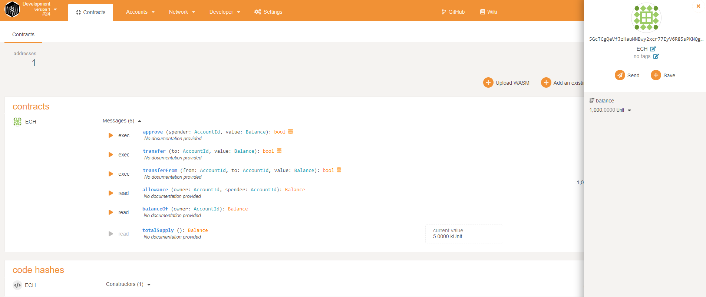
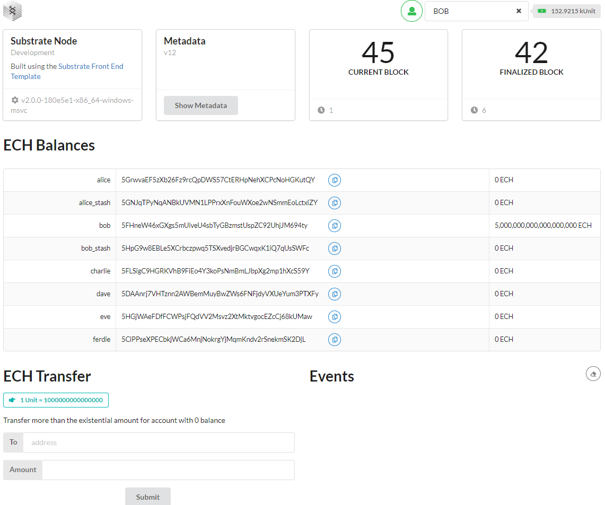
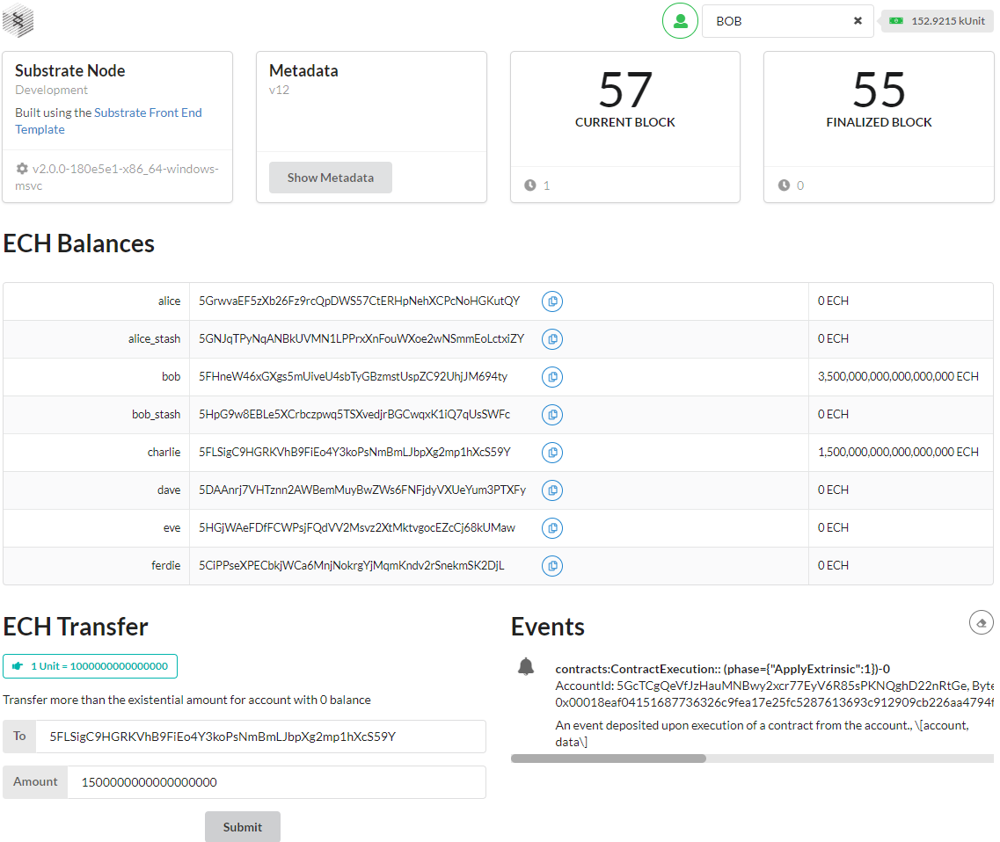
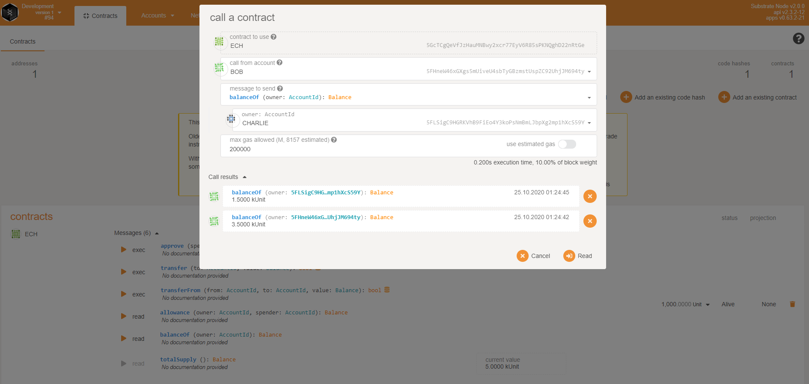

# ERC-20 Smart Contract With Ink!

Node with contracts pallet: https://github.com/Echolon166/HelloWorldbyPolkadot/tree/main/ink_smart_contracts/node

Front-end: https://github.com/Echolon166/HelloWorldbyPolkadot/tree/main/ink_smart_contracts/front-end

ERC-20 smart contract called ECH: https://github.com/Echolon166/HelloWorldbyPolkadot/tree/main/ink_smart_contracts/ech

- Deployed ERC-20 contract in [PolkadotJS Apps](https://polkadot.js.org/apps/#/explorer): 

- Front-end before transfer: 

- Front-end after transfer: 

- New balances after transfer confirmed in [PolkadotJS Apps](https://polkadot.js.org/apps/#/explorer): 

