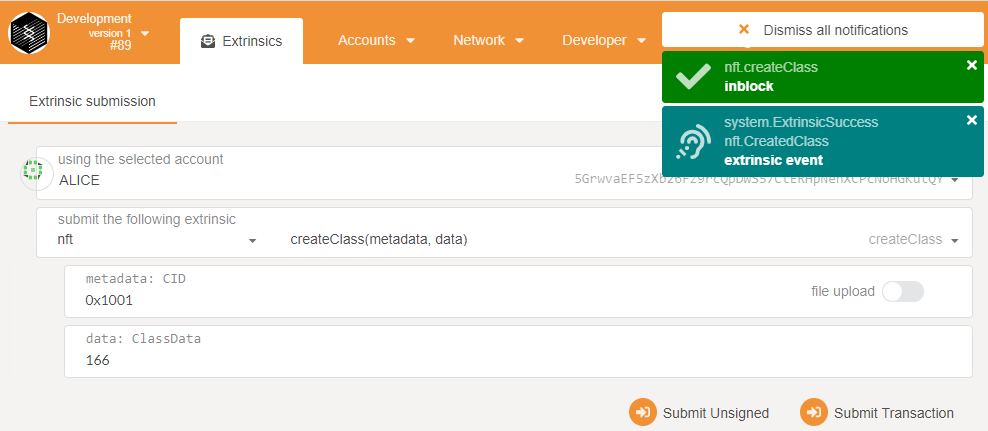
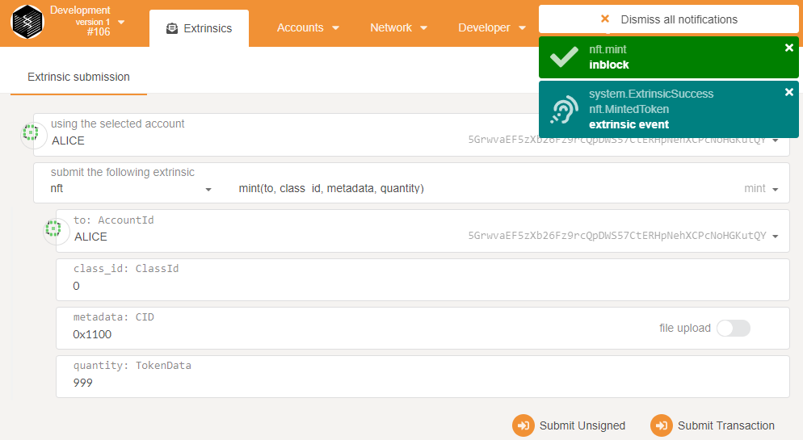
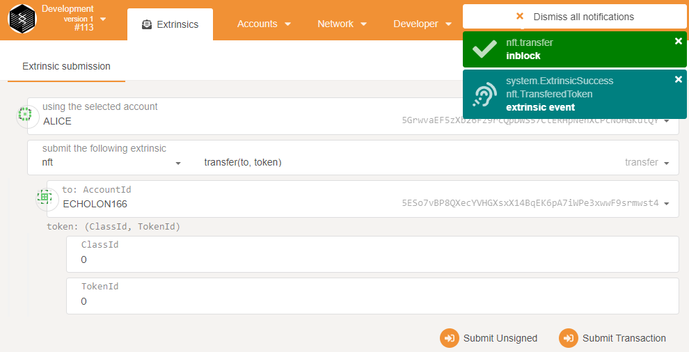
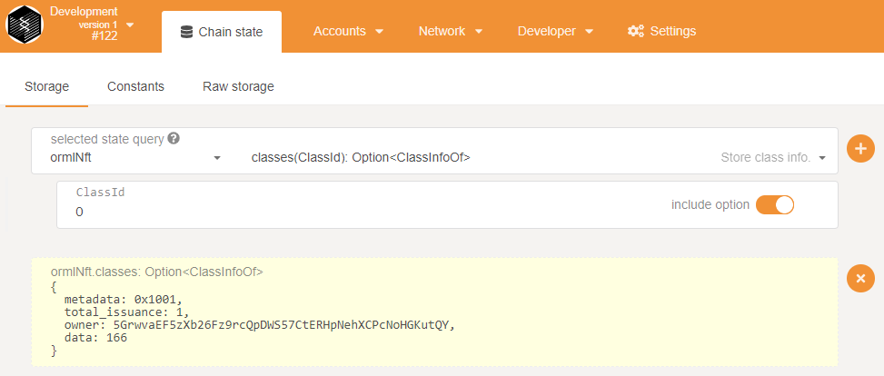
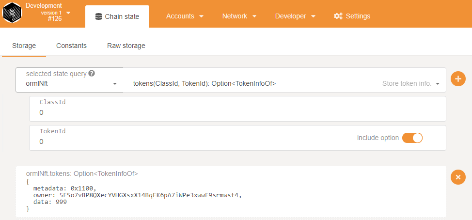

# Enable NFT Support

Runtime: https://github.com/Echolon166/HelloWorldbyPolkadot/tree/main/nft_support/node/runtime
Custom pallet to issue new NFT classes/mint tokens: https://github.com/Echolon166/HelloWorldbyPolkadot/tree/main/nft_support/node/pallets/nft

- Create a NFT class using NFT Pallet:



- Mint a NFT token using NFT Pallet:



- Transfer NFT tokens using NFT Pallet:



- Search NFT classes using Orml-NFT Pallet: 



- Search NFT tokens using Orml-NFT Pallet:



## Build & Run

If you need to,
[set up your Substrate development environment](https://substrate.dev/docs/en/knowledgebase/getting-started/#manual-installation).
Then, build and run a development chain:

```shell
$ cargo run -- --dev --tmp
```

Once the node is running, use this link to open the Polkadot JS Apps UI and connect to the Substrate
node: https://polkadot.js.org/apps/#/settings/developer?rpc=ws://127.0.0.1:9944. Use the Settings >
Developer app and the contents of the [`types.json`](node/types.json) file to add the
necessary types to the UI.